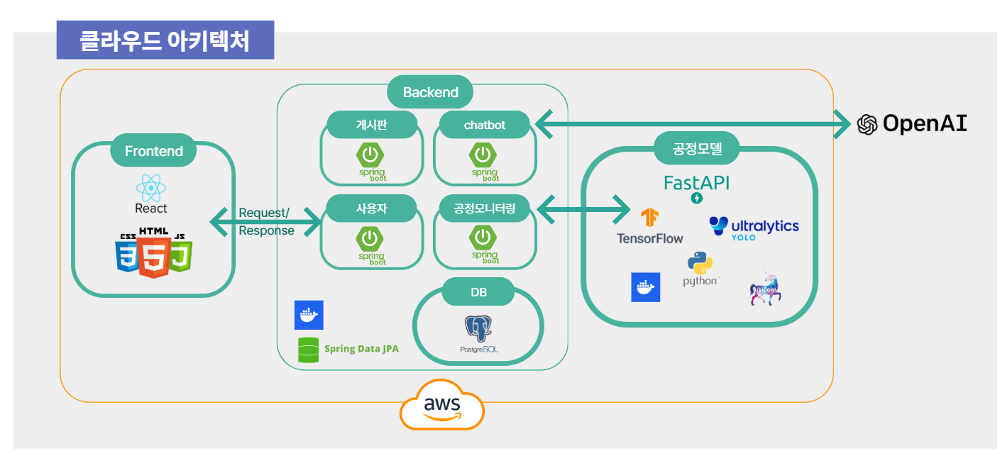
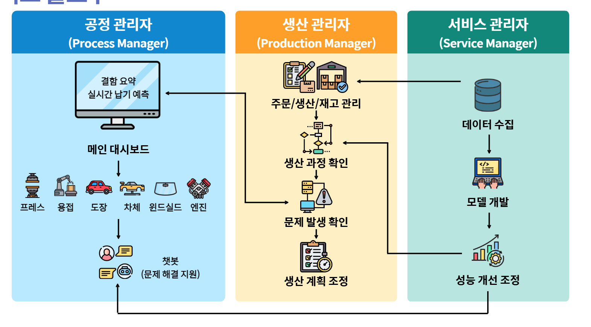

  # 자동차 공정 리스크 예측 플랫폼

현장 이미지·센서 데이터를 기반으로 차체, 도장, 엔진, 프레스, 용접 등 주요 공정의 이상 징후와 납기 리스크를 예측·시각화하는 풀스택 웹서비스입니다. 복수의 ML 모델과 공정 KPI를 단일 대시보드에서 모니터링하고, 챗봇·게시판을 통해 협업을 지원합니다.

  ## 프로젝트 소개
  - 제조 공정의 다중 데이터를 통합해 리스크를 조기에 감지하고 의사결정을 돕는 것을 목표로 합니다.
  - 비전/센서 기반 모델을 공정별로 분리하고, 대시보드에서 결과를 일관된 KPI로 비교합니다.
  - 업로드부터 예측, 히스토리 확인까지 한 화면에서 처리해 현장 대응 시간을 단축합니다.
  - 데모 환경에서도 실서비스와 유사한 역할 분리를 유지합니다 (FE, API, ML, Spring Boot).

  ## 기술 스택
  - Frontend: React, TypeScript, Vite, CSS
  - Backend (API): Node.js, Express, SQLite, JWT
  - Backend (Core): Java, Spring Boot, JPA
  - ML Service: Python, FastAPI, PyTorch/YOLO
  - Dev/Build: Gradle, npm, Vite
  - Data/Artifacts: YOLO weights, CSV/ARFF 샘플

## 주요 기능
- 종합/공정별 대시보드: 이상/경고 건수, 지연 시간 추정, KPI 카드, 공정 히스토리 차트.
- 비전/센서 기반 검사: 도장 불량, 차체 파트, 용접 이미지, 프레스 진동/이미지, 엔진(ARFF), 앞유리(CSV) 입력을 처리하는 모델 제공.
- 자동 샘플 테스트: paint/body/welding auto 엔드포인트로 샘플 폴더를 순차 검사하고 결과 이미지를 바로 확인.
- 사용자 인증·게시판: JWT 기반 회원가입/로그인과 게시글 CRUD(Express + SQLite).
- 챗봇: 납기 리스크/공정 상태 질의에 대한 템플릿 응답 제공.

## 아키텍처

- Frontend: Vite + React + TypeScript (대시보드, 업로드 UI) – [frontend](frontend)
- API Server: Node/Express, SQLite, JWT 인증, 게시판/대시보드/챗봇 API – [server](server)
- ML Service: FastAPI (windshield, engine, welding, paint, press, body inference) – [ml-service](ml-service)
- Spring Boot Backend: JPA + Security, PostgreSQL/H2 지원 확장형 REST 계층 – [backend](backend)
- 모델/아티팩트: YOLO 가중치와 예측 결과 샘플 – [ml-service](ml-service), [model](model)

## 서비스 플로우

- 서비스 관리자: 현장/운영 데이터 수집 -> 모델 개발 및 학습 -> 성능 평가/개선 -> 재배포
- 생산 관리자: 주문/생산/재고 관리 -> 공정 진행 모니터링 -> 문제 발생 확인 -> 생산 계획 조정
- 공정 관리자: 메인 대시보드에서 공정별 이상/납기 예측 확인 -> 챗봇으로 원인/대응 가이드 확인
- 연결 흐름: 운영 데이터가 모델 개선으로 환류되고, 개선 결과는 생산/공정 운영에 반영

## 빠른 실행
사전 요구: Node 18+, Python 3.10+, Java 21+, (Spring Boot 시) PostgreSQL. Node API 서버와 Spring Boot 모두 기본 3001 포트를 사용하므로 동시에 실행 시 포트 조정이 필요합니다.

### Frontend
```bash
cd frontend
npm install
npm run dev
```

### API Server (Express)
```bash
cd server
npm install
npm run dev   # 개발
# 또는
npm start     # 프로덕션
```

### ML Service (FastAPI)
```bash
cd ml-service
python -m venv .venv
source .venv/Scripts/activate    # Windows (PowerShell은 ./.venv/Scripts/Activate.ps1)
pip install -r requirements.txt
uvicorn main:app --host 0.0.0.0 --port 8000
```

주요 엔드포인트:
- /api/v1/smartfactory/paint, /api/v1/smartfactory/paint/auto
- /api/v1/smartfactory/welding/image, /api/v1/smartfactory/welding/image/auto
- /api/v1/smartfactory/body/inspect, /api/v1/smartfactory/body/inspect/auto
- /api/v1/smartfactory/engine, /api/v1/smartfactory/windshield, /api/v1/smartfactory/press/*, /health

### Spring Boot Backend
```bash
cd backend
export SPRING_PROFILES_ACTIVE=local
./gradlew bootRun        # Windows는 gradlew.bat bootRun
```
데이터소스 설정과 포트는 [backend/src/main/resources/application.properties](backend/src/main/resources/application.properties)에서 관리합니다 (기본: PostgreSQL, server.port=3001, context-path=/).
  
